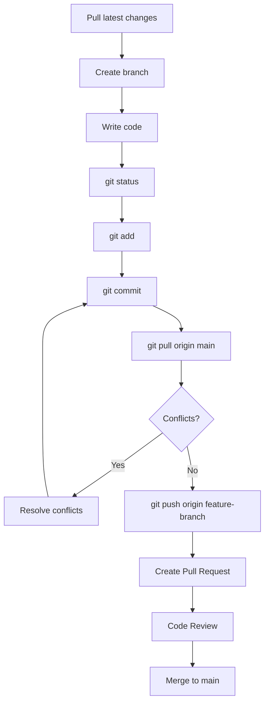

# 🧰 Git Cheat Sheet

> A practical, day-to-day Git handbook for Laravel/PHP developers. No fluff — only the commands you'll actually reach for while shipping client work.

---

## 📑 Table of Contents

1. [Initial Setup](#1-️-initial-setup)
2. [Creating & Cloning a Repository](#2--creating--cloning-a-repository)
3. [Checking Status](#3--checking-status)
4. [Staging Files](#4--staging-files)
5. [Committing Changes](#5--committing-changes)
6. [Branch Management](#6--branch-management)
7. [Remote Repository](#7--remote-repository)
8. [Push & Pull](#8--push--pull)
9. [Stashing](#9--stashing)
10. [Undoing Mistakes](#10--undoing-mistakes)
11. [Tags](#11-️-tags)
12. [Cleaning](#12--cleaning)
13. [Git Ignore](#13--git-ignore)
14. [GitHub Daily Workflow](#14--github-daily-workflow)
15. [Merge Conflicts](#15--merge-conflicts)
16. [Useful Log Commands](#16--useful-log-commands)
17. [Git Aliases](#17--git-aliases)
18. [Most Used Commands (Quick Reference)](#18--most-used-git-commands-quick-reference)
19. [Common Git Errors](#19--common-git-errors--fixes)
20. [Best Practices](#20--best-practices)
21. [Bonus: Daily Git Commands](#-bonus-daily-git-commands-one-page)

---

## 1. ⚙️ Initial Setup

Run these once per machine (or once per repo for local overrides).

```bash
git config --global user.name "Your Name"
git config --global user.email "you@example.com"
git config --list
```

| Command | What it does | When to use |
|---|---|---|
| `git config --global user.name "Your Name"` | Sets the name attached to your commits | Once, when setting up a new machine |
| `git config --global user.email "you@example.com"` | Sets the email attached to your commits | Once, when setting up a new machine |
| `git config --list` | Shows all active Git configuration values | To verify your identity/settings are correct |

> 💡 **Tip:** Drop `--global` to set a name/email for just one repository — handy when you use a different email for client vs personal projects.

```bash
# Repo-specific identity (no --global)
git config user.email "client-work@agency.com"
```

---

## 2. 📁 Creating & Cloning a Repository

| Command | What it does | When to use |
|---|---|---|
| `git init` | Turns the current folder into a new, empty Git repository | Starting a brand-new project from scratch |
| `git clone <url>` | Copies an existing remote repository (and its full history) to your machine | Joining an existing project / pulling down a client's repo |

```bash
git init
git clone https://github.com/username/project.git
git clone https://github.com/username/project.git my-folder-name
```

> ⚠️ **Warning:** Never run `git init` inside a folder that's already a Git repo (or inside another repo's folder) — it creates confusing nested `.git` folders.

---

## 3. 🔍 Checking Status

| Command | What it does | When to use |
|---|---|---|
| `git status` | Shows changed, staged, and untracked files | Before every add/commit — your "what's going on" command |
| `git log` | Shows full commit history | Reviewing project history |
| `git log --oneline` | Shows condensed, one-line-per-commit history | Quick scan of recent commits |
| `git diff` | Shows line-by-line changes not yet staged | Reviewing your edits before staging |

```bash
git status
git log
git log --oneline
git diff
git diff filename.php
```

> 💡 **Tip:** Run `git status` obsessively. It costs nothing and prevents 90% of "wait, what did I just do?" moments.

---

## 4. ➕ Staging Files

Staging means telling Git "include this change in my next commit."

| Command | What it does | When to use |
|---|---|---|
| `git add .` | Stages **all** changed/new files in the current directory | Quick staging when you've reviewed everything with `git status` |
| `git add filename` | Stages a **specific** file | When you want a precise, focused commit |
| `git restore --staged filename` | Unstages a file (keeps the edits, just removes it from the commit) | You staged something by mistake |
| `git rm filename` | Deletes a file and stages that deletion | Removing a file from the project entirely |
| `git mv old-name new-name` | Renames/moves a file and stages the change | Renaming files while keeping Git history intact |

```bash
git add .
git add app/Http/Controllers/UserController.php
git restore --staged config/app.php
git rm old-script.js
git mv Helper.php Helpers/Helper.php
```

> ⚠️ **Common mistake:** Running `git add .` blindly can stage `.env`, `vendor/`, or `node_modules/` if your `.gitignore` isn't set up properly. Always check `git status` first.

---

## 5. ✅ Committing Changes

| Command | What it does | When to use |
|---|---|---|
| `git commit -m "message"` | Saves staged changes as a new commit with a message | After staging — the actual "save point" in history |
| `git commit --amend` | Edits the **most recent** commit (message and/or staged content) | Fixing a typo in your last commit message, or adding a forgotten file |

```bash
git commit -m "Fix validation bug in checkout form"
git add forgotten-file.php
git commit --amend --no-edit
```

**Best practices for commit messages:**
- Use present tense: `"Add"` not `"Added"`.
- Be specific: `"Fix null pointer in OrderService"` beats `"fix bug"`.
- Keep the summary line under ~50 characters; add details in a body if needed.

> ⚠️ **Warning:** Never `--amend` a commit that has already been pushed and shared with others — it rewrites history and will cause conflicts for your teammates.

---

## 6. 🌿 Branch Management

| Command | What it does | When to use |
|---|---|---|
| `git branch` | Lists local branches | Checking what branches exist locally |
| `git branch -a` | Lists **all** branches (local + remote) | Seeing everything, including remote-only branches |
| `git checkout branch-name` | Switches to an existing branch | Older/legacy way to switch branches |
| `git switch branch-name` | Switches to an existing branch | Modern, safer alternative to `checkout` |
| `git switch -c new-branch` | Creates and switches to a new branch | Starting a new feature/fix |
| `git merge branch-name` | Merges another branch into your current branch | Combining finished work back into `main`/`develop` |
| `git rebase branch-name` | Replays your commits on top of another branch | Keeping a clean, linear history before merging |
| `git branch -d branch-name` | Deletes a branch (safe — blocks if unmerged) | Cleaning up after a merged feature branch |
| `git branch -D branch-name` | Force-deletes a branch (even if unmerged) | Discarding a branch you're sure you don't need |

```bash
git branch
git branch -a
git switch main
git switch -c feature/payment-gateway
git merge feature/payment-gateway
git rebase main
git branch -d feature/payment-gateway
git branch -D experimental-branch
```

### Merge vs Rebase

| | `git merge` | `git rebase` |
|---|---|---|
| History | Creates a merge commit; preserves exact history | Rewrites commits onto a new base; linear history |
| Safety | Safe for shared/public branches | Risky on shared branches (rewrites commit hashes) |
| Best for | Merging feature branches into `main` | Cleaning up your **local**, unpushed commits |

> ⚠️ **Rule of thumb:** Never rebase a branch that others are already working on or have pulled — it rewrites history and breaks their local copies.

---

## 7. 🌐 Remote Repository

| Command | What it does | When to use |
|---|---|---|
| `git remote -v` | Lists remote repositories and their URLs | Checking where your repo pushes/pulls from |
| `git remote add origin <url>` | Connects your local repo to a remote | Setting up a brand-new repo's remote for the first time |
| `git remote remove origin` | Disconnects a remote | Fixing a wrongly configured remote |
| `git remote set-url origin <url>` | Changes the URL of an existing remote | Repo moved, or switching from HTTPS to SSH |

```bash
git remote -v
git remote add origin git@github.com:username/project.git
git remote remove origin
git remote set-url origin git@github.com:username/new-repo.git
```

---

## 8. ⬆️⬇️ Push & Pull

| Command | What it does | When to use |
|---|---|---|
| `git push` | Uploads your local commits to the remote | Sharing your committed work |
| `git push -u origin branch-name` | Pushes a branch **and** sets it to track the remote branch | First push of a new branch |
| `git pull` | Fetches remote changes **and** merges them into your current branch | Getting the latest changes before you keep working |
| `git fetch` | Downloads remote changes **without** merging them | Checking what's new remotely without touching your files |

```bash
git push
git push -u origin feature/payment-gateway
git pull
git pull origin main
git fetch
git fetch origin
```

### Fetch vs Pull

- **`git fetch`** = "show me what changed remotely" — safe, doesn't touch your working files.
- **`git pull`** = `git fetch` + `git merge` combined — updates your current branch immediately.

> 💡 **Tip:** If you want to inspect incoming changes before merging them, use `git fetch` then `git diff main origin/main`.

---

## 9. 📦 Stashing

Stashing temporarily shelves uncommitted changes so you can switch context cleanly.

| Command | What it does | When to use |
|---|---|---|
| `git stash` | Saves uncommitted changes and reverts your working directory to clean | Need to switch branches but aren't ready to commit |
| `git stash list` | Shows all stashed changesets | Checking what you've stashed |
| `git stash pop` | Re-applies the latest stash **and removes it** from the stash list | Resuming work after switching back |
| `git stash apply` | Re-applies the latest stash but **keeps it** in the stash list | Applying the same stash to multiple branches |
| `git stash drop` | Deletes a stash without applying it | Cleaning up stashes you no longer need |

```bash
git stash
git stash list
git stash pop
git stash apply stash@{1}
git stash drop stash@{0}
```

**Practical example:** You're mid-feature, and your client reports an urgent bug on `main`.

```bash
git stash                     # save your unfinished work
git switch main
git switch -c hotfix/urgent-bug
# ...fix the bug, commit, push...
git switch feature/your-feature
git stash pop                 # bring your work back
```

---

## 10. ↩️ Undoing Mistakes

| Command | What it does | When to use |
|---|---|---|
| `git restore filename` | Discards uncommitted changes in a file | Throwing away edits you don't want |
| `git reset` | Moves the branch pointer, optionally changing staged/working files | Undoing commits (various levels — see below) |
| `git reset --soft HEAD~1` | Undoes the last commit, keeps changes **staged** | You committed too early, want to re-commit differently |
| `git reset --mixed HEAD~1` | Undoes the last commit, keeps changes **unstaged** (default mode) | You want to re-review and re-stage changes |
| `git reset --hard HEAD~1` | Undoes the last commit and **deletes** the changes entirely | You're 100% sure you want to discard that work |
| `git revert <commit-hash>` | Creates a **new** commit that undoes a previous commit | Undoing a commit that's already been pushed/shared |

```bash
git restore app.php
git reset --soft HEAD~1
git reset --mixed HEAD~1
git reset --hard HEAD~1
git revert a1b2c3d
```

> ⚠️ **When NOT to use `git reset --hard`:**
> - Never use it on commits that have already been **pushed and shared** — it rewrites history other people rely on.
> - It **permanently deletes** uncommitted work with no undo. Double-check `git status` before running it.
> - On shared branches, use `git revert` instead — it's non-destructive and safe for team history.

---

## 11. 🏷️ Tags

Tags mark specific points in history — typically releases.

| Command | What it does | When to use |
|---|---|---|
| `git tag` | Lists existing tags | Checking release history |
| `git tag -a v1.0.0 -m "message"` | Creates an annotated tag (with metadata) | Marking a release version |
| `git push origin tag-name` | Pushes a tag to the remote | Sharing a release tag with the team |

```bash
git tag
git tag -a v1.2.0 -m "Release: checkout flow rewrite"
git push origin v1.2.0
git push origin --tags   # push all tags at once
```

---

## 12. 🧹 Cleaning

| Command | What it does | When to use |
|---|---|---|
| `git clean` | Removes untracked files | Clearing out build artifacts / temp files |
| `git clean -fd` | Force-removes untracked files **and** directories | Deep clean of an untracked mess |

```bash
git clean -n     # DRY RUN — preview what would be deleted
git clean -f      # actually delete untracked files
git clean -fd     # also delete untracked directories
```

> ⚠️ **Warning:** `git clean` **permanently deletes** files — there's no recycle bin. **Always run `git clean -n` (dry run) first** to see exactly what will be removed before adding `-f`.

---

## 13. 📄 Git Ignore

`.gitignore` tells Git which files/folders to never track (dependencies, secrets, build output, editor settings).

```bash
# Laravel
/vendor
/node_modules
.env
.env.backup
/public/hot
/public/storage
/storage/*.key
/bootstrap/cache/*.php
Homestead.json
Homestead.yaml
auth.json
npm-debug.log
yarn-error.log

# Node
node_modules/
dist/
npm-debug.log
.env

# VS Code
.vscode/
*.code-workspace
```

> ⚠️ **Critical:** Never commit `.env` — it holds database credentials, API keys, and app secrets. If you've already committed one by mistake, rotate every credential inside it immediately and remove it from history (`git rm --cached .env`, then commit).

---

## 14. 🔁 GitHub Daily Workflow

A typical day working with a feature branch and Pull Requests:



```bash
git switch main
git pull origin main
git switch -c feature/new-invoice-pdf

# ...write code...

git status
git add .
git commit -m "Add PDF export for invoices"
git pull origin main
git push origin feature/new-invoice-pdf
# Open a Pull Request on GitHub → Review → Merge
```

---

## 15. ⚔️ Merge Conflicts

**Why they happen:** Two branches changed the *same lines* of the *same file* in different ways, and Git can't automatically decide which version is correct.

**How to resolve:**

1. Run `git status` to see which files are conflicted.
2. Open each conflicted file — Git marks the conflicting sections:
   ```
   <<<<<<< HEAD
   your current branch's code
   =======
   incoming branch's code
   >>>>>>> feature/branch-name
   ```
3. Manually edit the file to keep the correct code (remove the `<<<<<<<`, `=======`, `>>>>>>>` markers).
4. Stage the resolved file and continue.

```bash
git status                  # see conflicted files
# ...edit files to resolve...
git add resolved-file.php
git commit                  # finishes the merge
# or, if mid-rebase:
git rebase --continue
```

**Best practices:**
- Pull frequently to keep conflicts small and infrequent.
- Communicate with teammates when editing shared files.
- When in doubt, talk to whoever wrote the conflicting code rather than guessing.
- Use a visual merge tool (VS Code's built-in merge editor works well) for complex conflicts.

---

## 16. 📊 Useful Log Commands

| Command | What it does | When to use |
|---|---|---|
| `git log --graph` | Shows commit history as an ASCII branch graph | Visualizing how branches diverged/merged |
| `git log --decorate` | Shows branch/tag names next to commits | Seeing which commits branches/tags point to |
| `git log --stat` | Shows which files changed and by how much per commit | Reviewing the size/scope of past commits |
| `git shortlog` | Groups commits by author with counts | Summarizing contributions across a team |

```bash
git log --graph --oneline --decorate --all
git log --stat
git shortlog -sn
```

---

## 17. 🔤 Git Aliases

Add these to `~/.gitconfig` (or run as `git config --global alias.X "Y"`) to save keystrokes.

| Alias | Full Command | What it does |
|---|---|---|
| `gst` | `git status` | Quick status check |
| `gco` | `git checkout` | Switch branches/files |
| `gcm` | `git commit -m` | Commit with a message |
| `gpl` | `git pull` | Pull latest changes |
| `gps` | `git push` | Push your commits |
| `gbr` | `git branch` | List branches |

```bash
git config --global alias.gst "status"
git config --global alias.gco "checkout"
git config --global alias.gcm "commit -m"
git config --global alias.gpl "pull"
git config --global alias.gps "push"
git config --global alias.gbr "branch"
```

Usage after setup:

```bash
gst
gcm "Fix invoice rounding bug"
gpl
gps
```

---

## 18. ⭐ Most Used Git Commands (Quick Reference)

| Command | Purpose | Usage Frequency |
|---|---|---|
| `git status` | Check what's changed | Every few minutes |
| `git add .` | Stage all changes | Multiple times/day |
| `git commit -m ""` | Save a snapshot | Multiple times/day |
| `git pull` | Get latest changes | Multiple times/day |
| `git push` | Share your commits | Multiple times/day |
| `git switch -c` | Create a new branch | Daily |
| `git switch` | Change branches | Daily |
| `git log --oneline` | Review recent history | Daily |
| `git diff` | Review your edits | Daily |
| `git stash` / `git stash pop` | Temporarily shelve work | A few times/week |
| `git fetch` | Check remote updates | A few times/week |
| `git merge` | Combine branches | A few times/week |
| `git rebase` | Clean up local history | Occasionally |
| `git reset` | Undo commits | Occasionally |
| `git revert` | Safely undo pushed commits | Occasionally |
| `git tag` | Mark a release | Per release |
| `git clean -fd` | Remove untracked files | Rarely (with caution) |

---

## 19. 🐞 Common Git Errors & Fixes

| Error | Cause | Fix |
|---|---|---|
| **`detached HEAD`** | You checked out a specific commit/tag instead of a branch | Create a branch to save your work: `git switch -c new-branch-name`, or `git switch main` to discard and return |
| **`! [rejected] ... (fetch first)`** (rejected push) | Remote has commits you don't have locally | Run `git pull origin branch-name` (or `git fetch` + `git rebase`), resolve conflicts, then push again |
| **`CONFLICT (content): Merge conflict in ...`** | Two branches edited the same lines | Open the file, resolve the `<<<<<<<`/`=======`/`>>>>>>>` markers, `git add`, then commit or `git rebase --continue` |
| **`fatal: remote origin already exists`** | Trying to `git remote add origin` when one's already set | Use `git remote set-url origin <url>` instead, or `git remote remove origin` first |
| **`fatal: not a git repository`** | You're running a Git command outside a repo folder | `cd` into the correct project folder, or run `git init` if it should be a new repo |

---

## 20. 🏆 Best Practices

1. Commit small, focused changes — not giant "end of day" dumps.
2. Write clear, meaningful commit messages.
3. Pull before you start working, and before you push.
4. **Never** commit `.env` or any file with secrets/credentials.
5. Never force-push (`git push -f`) to `main`/`develop`.
6. Always use feature branches — don't commit directly to `main`.
7. Review your `git diff` before staging/committing.
8. Keep `.gitignore` up to date from day one of a project.
9. Use descriptive branch names: `feature/`, `fix/`, `hotfix/`.
10. Rebase local, unpushed commits only — never rebase shared history.
11. Squash noisy "WIP" commits before merging into `main`.
12. Tag every production release.
13. Don't mix unrelated changes in a single commit.
14. Use Pull Requests for code review, even on small teams.
15. Delete branches after they're merged to keep the repo tidy.
16. Prefer `git revert` over `git reset --hard` on shared branches.
17. Run `git status` before and after major operations.
18. Back up important stashes — they can be lost if not tracked carefully.
19. Communicate with your team before rewriting shared history.
20. Automate what you can (CI/CD, pre-commit hooks) instead of relying on memory.

---

## 🚀 Bonus: Daily Git Commands (One Page)

The commands you'll type almost every single day:

```bash
git status
git add .
git commit -m ""
git pull
git push
git switch
git switch -c
git branch
git fetch
git stash
git stash pop
git log --oneline
```

> 📌 **Pin this section.** If you only remember one part of this cheat sheet, make it this one.